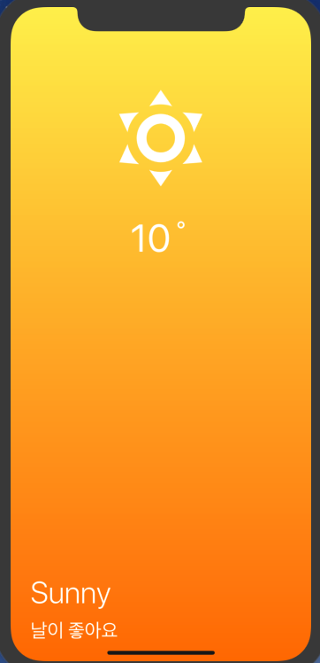

Weather APP
=============
created by __React native__, __open weather map API__   
Related posts can be found in the 
<a href="http://samsara1019.tistory.com/category/%ED%94%84%EB%A1%9C%EC%A0%9D%ED%8A%B8/%5Breact%5Dweather_app" target=_blank>blog</a>.  

**리액트네이티브**와 __open weather map API__ 만들어졌습니다.  
관련 포스팅은 <a href="http://samsara1019.tistory.com/category/%ED%94%84%EB%A1%9C%EC%A0%9D%ED%8A%B8/%5Breact%5Dweather_app" target=_blank>블로그</a>에서 확인하실 수 있습니다.  

android apk
-------------
<https://exp-shell-app-assets.s3-us-west-1.amazonaws.com/android%2F%40samsara%2Fweather-5a8d7c06-4e98-11e8-bd4d-0a580a781f14-signed.apk>

* * *
image
-------------

